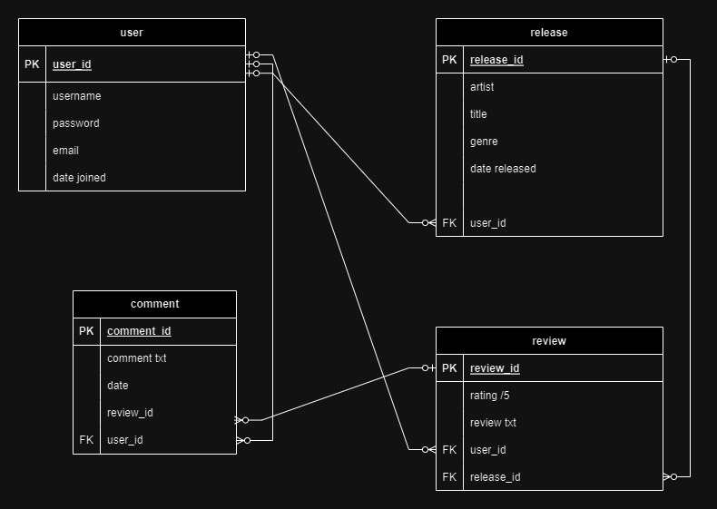

<h1>George Sheridan API Webserver Project</h1>

Github: https://github.com/ggrrrgg/CassetteRev_API

Trello board: https://trello.com/b/lYuECRJh/georgesheridant2a4api

<h3>Installation Instructions</h3>

Download or clone the repository from github link provided above.

You will need recent versions of Python3 and postgresql installed.

Open a terminal instance and enter 

```sudo service postgresql start``` to start the server

then

```sudo -u postgres psql``` (for windows/wsl)

Then create a user and set password

```CREATE USER cassette_rev_dev WITH PASSWORD '123456'```

Create the database

```CREATE DATABASE cassette_rev WITH OWNER= cassette_rev_dev```

Grant yourself priveledges to use the database

```GRANT ALL PRIVILEGES ON DATABASE cassette_rev TO cassette_rev_dev```

Check it has worked by typing

```\l```

Then connect to the database

```\c cassette_rev;```

In another terminal instance navigate to the src folder and create/activate a virtual environment

```python3 -m venv .venv```

```source .venv/bin/activate```

Install the requirements

```pip3 install -r requirements.txt```

Then run the following commands to create the tables, and seed them with some data (admin user is created here)

```flask db create```

```flask db seed```

You can then check the postgres terminal instance to see this has worked by typing ```\dt``` and you should see the 4 tables there.

Finally run the app

```flask run```

---
<h3>R1 Problem</h3>

There are, out there people who still love to buy and listen to music on cassette. It has its appeals, like vinyl (but much cheaper), owning a physical, tangible copy of an album that you love that has great artwork and liner notes to explore as you listen is a much more immersive experience than listening to streaming services. Cassettes are loved for their nostalgic quality (to certain generations) and the sonic imprint the medium imparts is comfortable to listen to, and compliments many styles of music (lofi electronic music and ambient music are strong modern genres).

There are not many places online that cater to this community and what is available is scattered between reddit threads and personal bloggers. A more central app that is able to keep up to date with new releases and provide a space for enthusiasts to share their own discoveries could be a great resource for that community.

---
<h3>R2 Why</h3>

The hope would be that in providing a space for the cassette loving community to come together the community grows, pulling in people new to the format. Having an easy way to have peers recommend music that is outside the streaming service algos leads to more interesting, unique and independently made discoveries. Encouraging a more relaxed and linearly focused way to enjoy music is a small dose, but a healthy antidote to the scattered attention lifestyle of the current smartphone / internet age.

This version of the app is intended as a simple framework of what it could become, admin users are able to add releases to keep users up to date with the latest. Users are then able to discuss those releases by leaving reviews and commenting on eachothers reviews. Users can also add their own discovered releases. More detail can be added around the specifics of the cassette pressing, tape type quality, and reissue details etc in their review if they wish. I'd like to integrate a bandcamp API to provide artwork and streaming and a link to purchase, but I ran out of time unfortunately.

<h3>R3 Why PostgreSQL</h3>

I have used PostgreSQL for this project, it has these advantages:

<i>Transactions</i> - PostgreSQL provides transactional DDL, allowing complex relational applications to make changes to both the application and the database schema within a single transaction, eliminating the need for extensive error handling code.

<i>Code comments</i> - PostgreSQL allows code comments, enabling better understanding of code functionality and facilitating collaboration which is important for any future the app may have.

<i>Data Integrity</i> - PostgreSQL is known for its data integrity, thanks to its ACID compliance that ensures reliable data storage, retrieval, and management.

<i>Scalability</i> - PostgreSQL can handle large datasets with ease and can scale up or down as per business needs without compromising data integrity or performance.

<i>Great Community</i> - PostgreSQL has a vibrant and enthusiastic community of developers, users, and contributors that continually improve the database and provide excellent support to users worldwide.

<i>Extensibility</i> - PostgreSQL is highly extensible, allowing users to add additional features, functions, data types, and languages to the database. It provides a packaging tool for installing add-ons and supports a wide range of languages, including JavaScript.

<i>Security features</i> - PostgreSQL includes built-in security features and allows the use of extensions to enhance security. It offers parameter security and application security, allowing for fine-grained control over user privileges and access permissions.

<b>Disadvantages of PostgreSQL:</b>

<i>Database structure</i> - PostgreSQL follows a strict relational database structure, which requires predefined schemas and fields. Adding additional data attributes or changing the schema can be cumbersome compared to NoSQL databases like MongoDB, which have more flexible document-based structures.

<i>Open source</i> - Being open source, PostgreSQL lacks the backing of a single organization and may face challenges in terms of awareness, support, and compatibility. There is no warranty, liability protection, or indemnity for the software.

<i>Complexity</i> - PostgreSQL can be complex to set up and configure compared to other databases, but this can be overcome by using cloud-based services or managed hosting solutions that simplify the process.

<i>Fewer Tools</i> - Compared to other databases such as MySQL or Oracle, PostgreSQL has fewer tools available for monitoring, backup, and performance tuning, but there are still many third-party tools available to fill the gap.

<i>Slower performance</i> - PostgreSQL's relational structure can result in slower performance when querying large tables with many fields, as it needs to scan the entire table to find relevant data. Performance issues and backup recovery challenges may arise in certain scenarios.

PostgreSQL offers numerous advantages and disadvantages but remains a highly functional and widely used database system known for its robustness, reliability, and scalability, making it an excellent choice for this app.

---
<h3> ORM </h3>

The ORM (Object-Relational Mapping) allows us to interact with a relational database using an object-oriented programming language. It essentially bridges the gap between the object-oriented world of programming languages and the relational world of databases. 

In this case the ORM used is SQLAlchemy, bridging the gap between Python and PostgreSQL.

ORMs provide a higher-level abstraction over database operations. Instead of writing raw SQL queries, we can work with objects and classes that directly represent database tables and relationships. 
For example in this app, database tables are represented as Python classes:

```
class Release(db.Model):
    __tablename__ = 'releases'
    id = db.Column(db.Integer, primary_key=True)
    artist = db.Column(db.String, nullable=False)
    title = db.Column(db.String, nullable=False)
    date_released = db.Column(db.Date)
    genre = db.Column(db.String)
```

An entry is then declared as a Python object:

```
Release(
            artist='de la soul',
            title='stakes is high',
            date_released='2/7/96',
            genre='Hip Hop',
        )
```

The postgres command for this entry would look like this
```
INSERT INTO releases (artist, title, date_released, genre)
VALUES ('de la soul', 'stakes is high', '1996-02-07', 'Hip Hop');
```

If we had to make every entry this way it would get very time consuming for large datasets and errors are typos are easily made.

Should note also that SQLalchemy is interchangable between DBMS's, we could use the same app with MySQL, SQLite without having to change the code significantly.

SQLAlchemy also simplifies the Create, Read, Update, and Delete (CRUD) operations. We can perform these using method calls on objects, without having to write raw SQL statements.

Additionally we can compose queries using high-level language constructs rather than dealing with SQL directly, making query construction more readable and maintainable.

SQLAlchemy alo handles table relationships, and has built in validation mechanisms that makes sure the the databse integrity is kept to a maximum.

---
<h3> R5 Endpoints </h3>

<b>auth/profile/id (GET)</b>
```
Endpoint to view a users profile, no login or permissions required.

If user invalid user id given, client is returned a not found error message
```

<b>auth/signup (POST)</b>
```
Sign up route for new users.

Integrity errors in place to ensure unique email for each user profile and no required fields are left null.
```
<b>auth/login (POST)</b>

```
login route requires email and password to match db, if ok issues jwt with 24 hour expiry.

if email and pw do not match, returns error message to client.
```

<b>auth/editprofile/id(PUT, PATCH)</b>
```
requires user to be logged in or be an admin.

admins can edit user name or password (incase a reset is needed), andalso make any other user an admin.

user can edit username or password.

if successful message returned confirming.

not found error returns if user not found.
```
<b>auth/delete/id(DELETE)</b>
```
requires user login or to be admin.

if so returns username deleted success message 201.

if invalid user logged in, not authorised 403 returned.
```
<b>RELEASE ROUTES</b>

<b>releases/new (POST)</b>
```
requires user or admin login.

checks if release has already been created by another user by checking against artist and title. returns error message if so.

201 returns release info to client.
```
<b>releases(GET)</b>
```
displays all releases and associated reviews and comments

no login required
```
<b>releases/id(GET)</b>
```
displays a single release and it associated reviews and comments.

no login required.

returns not found message for invalid release id.
```
<b>releases/id(DELETE)</b>
```
requires admin login. no user can delete a release.

returns 201 release title deleted message
or not authorised if not admin, 403
```
<b>releases/id(PUT PATCH)</b>
```
user or admin can edit release artist, title, release date, or genre.

201 returns updated release info

403 returns if no jwt or not owner of release 

404 returns if release id is not found
```
<b>REVIEWS</b>

releases/id/reviews/id(GET)
```
returns a single review and any associated comments for a given release.

returns a not found error if release, review id do not match db.
```
*note no endpoint to view all reviews necessary as all reviews are displayed when using the GET release route above*

<b>releases/id/reviews(POST)</b>
```
requires login

matches given release id.

checks if rating given for release is between 0 and 10, returns 400 error message if not.

201 returns review info to client

404 not found error returned if release id not found.
```
<b>releases/id/reviews/id(DELETE)</b>
```
requires user or admin login

returns 403 unauthorised error message if neither

returns 201 succesfully deleted if OK

or returns 404 not found error if release, review id is not matched
```
<b>releases/id/reviews/id</b>
```
requires user or admin login

matches review id

checks if current user is owner of review, returns 403 if not

checks if current user is admin, returns 403 i not

if rating is being edited, checks for valid value 0- 10, returns 409 error if not

if all OK allows edit and returns review info 201

or returns 404 not found if releasse, review id do not match
```
<b>COMMENTS</b>

<b>releases/id/id/comment/id(GET)</b>
```
view a single comment.

no login required.

matches comment by release, review, and comment id

if match returns 201 with comment info

if no match 404 not found error
```
*note no endpoint to view all comments necessary as all comments for a review are displayed when using the GET review route above*

<b>releases/id/id/comment(POST)</b>
```
user login required

matches release and review id

201 returns successful comment data

404 not found if mismatched release review id
```
<b>releases/id/id/comment/id(DELETE)</b>
```
requires user or admin login

matches comment from release, review, comment id

checks current user is comment owner

checks if current user is admin, returns 403 not authorised error if neither

if OK returns 201 successfully deleted message

if not found, 404 error
```
<b>releases/id/id/comment/id(PUT PATCH)</b>
```
requires user login, admin cannot edit comments

matches comment id

checks current jwt user is comment owner, returns 403 if not

if OK allows editing of comment text

201 returns edited comment info

404 not found if ids do not match.
```
---
<h3>R6 ERD</h3>


---
<h3>R7 3rd Parties </h3>

### Flask

Flask is a lightweight Python web framework known for its simplicity and flexibility. It provides essential components for web development, making it popular among developers for building scalable and maintainable web applications. Flask's modular design and numerous extensions enable easy customization and integration with other tools.

### SQLAlchemy

SQLAlchemy is a powerful and widely used Python ORM (Object-Relational Mapping) library. It provides a convenient way to interact with databases. SQLAlchemy allows developers to work with databases using Python objects, making it easy to build and manage database-driven applications.

### Marshmallow

Marshmallow is a Python library used for object serialization and validation. It allows developers to convert complex data types, such as Python objects, to and from JSON or other formats easily. Marshmallow provides a simple and flexible approach to data validation, ensuring that data adheres to defined schemas.

### psycopg2

Psycopg2 is a widely-used PostgreSQL adapter for Python. It enables Python applications to interact with PostgreSQL databases efficiently and securely. Psycopg2 is known for its performance, stability, and compliance with the Python DB-API specification. It allows developers to execute SQL queries, manage transactions, and handle data retrieval seamlessly.

### bcrypt

Bcrypt is a widely-used password hashing library for Python. It offers a secure way to hash passwords, making them resistant to brute-force attacks. Bcrypt employs a computationally intensive algorithm, which slows down the hashing process and adds a layer of protection against password cracking attempts. 

### JWT

JWT (JSON Web Tokens) is a popular standard for securely transmitting information between parties as JSON objects. It is commonly used for user authentication and authorization in web applications and APIs. JWTs consist of three parts: header, payload, and signature. The header contains metadata about the token, the payload carries the user's claims, and the signature ensures the token's integrity. 

---
### R8 Model Relationships

<b>User Model</b>
```
class User(db.Model):
    __tablename__ = 'users'
# users table columns
    id = db.Column(db.Integer, primary_key=True)
    username = db.Column(db.String, nullable=False)
    email = db.Column(db.String, nullable=False, unique=True)
    password = db.Column(db.String, nullable=False)
    date = db.Column(db.Date)
    is_admin = db.Column(db.Boolean, default=False)
# define Flask relationships to reflect foreign keys
    releases = db.relationship('Release', back_populates='user', cascade='all, delete')
    reviews = db.relationship('Review', back_populates='user', cascade='all, delete')
    comments = db.relationship('Comment', back_populates='user', cascade='all, delete')
```

user model has a one to many relationship with all other tables, and is a foreign key in all other tables. it has a cascading delete to releases, reviews and comments, if a user is deleted all their content goes with them.

<b>Release Model</b>

```
class Release(db.Model):
    __tablename__ = 'releases'
# release table columns
    id = db.Column(db.Integer, primary_key=True)
    artist = db.Column(db.String, nullable=False)
    title = db.Column(db.String, nullable=False)
    date_released = db.Column(db.Date)
    genre = db.Column(db.String)
# foreign keys
    user_id = db.Column(db.Integer, db.ForeignKey('users.id'), nullable=False)
# define Flask relationships to reflect foreign keys
    user = db.relationship('User', back_populates='releases')
    reviews = db.relationship('Review', back_populates='releases', cascade='all, delete')
```

release model, in addition to user relationship, has a one to many relationship with reviews and is a foreign key in the review model. if a release is deleted, reviews are all deleted also.

<b>Review Model</b>

```
class Review(db.Model):
    __tablename__ = 'reviews'
# review table columns
    id = db.Column(db.Integer, primary_key=True)
    rating = db.Column(db.Integer)
    review_txt = db.Column(db.Text)
# foreign keys
    user_id = db.Column(db.Integer, db.ForeignKey('users.id'), nullable=False)
    release_id = db.Column(db.Integer, db.ForeignKey('releases.id'), nullable=False)
# define Flask relationships to reflect foreign keys
    user = db.relationship('User', back_populates='reviews') 
    releases = db.relationship('Release', back_populates='reviews')
    comments = db.relationship('Comment', back_populates='reviews', cascade='all, delete')
```

review model, in addition above, has a one to many relationship with comments and is a foreign key in the comment model. if a review is deleted, comments are all deleted also but release and user remain.

<b>Comment Model</b>

```
class Comment(db.Model):
    __tablename__ = 'comments'
# Comment table columns
    id = db.Column(db.Integer, primary_key=True)
    comment_txt = db.Column(db.Text)
# foreign key columns
    user_id = db.Column(db.Integer, db.ForeignKey('users.id'), nullable=False)
    review_id = db.Column(db.Integer, db.ForeignKey('reviews.id'), nullable=False)
# Define Flask relationships to reflect foreign keys
    user = db.relationship('User', back_populates='comments')
    reviews = db.relationship('Review', back_populates='comments')
```

comment model relationships all stated above

---

### R9 DB Relations

User table holds all user profile data and its primary key is held in all other tables as a foreign key to declare ownership over user releases, reviews, and comments.
It has the following data columns:

- user_id - integer, Primary Key
- username - string, not nullable
- email - string, not nullable and must be unique
- password - string, bcrypt hashed 
- date - date, auto generated on day of user creation
- is_admin - boolean

The Releases table holds all information pertaining to each release added to the database. It relates to the user table and the review table, as described in R8. It holds the following:

- release id, integer, primary key
- artist, string, not nullable, artist name 
- title, string, not nullable, title of the album, ep, or single release 
- date releases, date of the releases release.
- genre, string, music genre of the release

The Review table holds all information pertaining to reviews of releases. It relates to all other tables in the db. a user may own many reviews, a release may own many reviews, and review may own many comments.
It contains the following:

- review id, integer, primary key
- rating, integer, /10
- review text - text

The Comment table holds information pertaining to comments on reviews of releases. It relates to the user table and reviews table. A user may own many comments, and a review may have many comments. It contains the following:

- comment id, integer, primary key
- comment txt - text

### R10 Task Tracking

I relied on the trello board linked above to keep track of progress on the app. I broke down each stage of the assignment into cards with checkmarks to mark off as I went. This helped keep the finish line in sight and manage my time as best as possible. 

Once I started building controllers I was able to test routes as I went and troubleshoot, each card had a test checkmark to pass. And I added an issues card for problems that I could return to later so as not to lose track of any problems or get held up on something small but time consuming to research a fix for.

Note there is a 'nice to haves card' that I didnt get around to, so remains in the to do column. Hopefully I'll return to this idea at some point in the future where I can address those.


